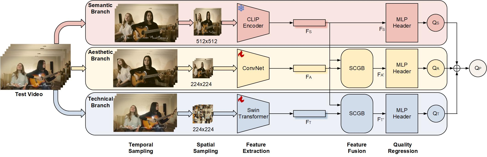

# 🏆 [CVPRW 2024] [COVER](https://openaccess.thecvf.com/content/CVPR2024W/AI4Streaming/papers/He_COVER_A_Comprehensive_Video_Quality_Evaluator_CVPRW_2024_paper.pdf): A Comprehensive Video Quality Evaluator. 

🏆 🥇 **Winner solution for [Video Quality Assessment Challenge](https://codalab.lisn.upsaclay.fr/competitions/17340) at the 1st [AIS 2024](https://ai4streaming-workshop.github.io/) workshop @ CVPR 2024** 

Official Code for [CVPR Workshop 2024] Paper *"COVER: A Comprehensive Video Quality Evaluator"*. 
Official Code, Demo, Weights for the [Comprehensive Video Quality Evaluator (COVER)](https://openaccess.thecvf.com/content/CVPR2024W/AI4Streaming/papers/He_COVER_A_Comprehensive_Video_Quality_Evaluator_CVPRW_2024_paper.pdf).

- 17 June 2024: We presented our solution in the AIS 2024 workshop in CVPR 2024! See the photo [here](https://github.com/vztu/COVER/blob/main/figs/_DSF6163-Enhanced-NR.JPG).
- 29 May 2024: We create a space for [COVER](https://huggingface.co/spaces/vztu/COVER) on Hugging Face, with ZeroGPU enabled!
- 09 May 2024: We upload the Code of [COVER](https://github.com/vztu/COVER).
- 12 Apr 2024: COVER has been accepted by CVPR Workshop2024.

[](https://openaccess.thecvf.com/content/CVPR2024W/AI4Streaming/html/He_COVER_A_Comprehensive_Video_Quality_Evaluator_CVPRW_2024_paper.html)
[](https://docs.google.com/presentation/d/18AcozoBEGj1l6qMTBxu0DoxCMin9JkeUMoSOHWP02jE/edit?usp=sharing)
 [](https://github.com/vztu/COVER)
[](https://github.com/vztu/COVER)
<a href="https://huggingface.co/spaces/vztu/COVER"></a> 


## Introduction
- Existing UGC VQA models strive to quantify quality degradation mainly from the technical aspect, with a few considering aesthetic or semantic aspects, but no model has addressed all three aspects simultaneously.
- The demand for high-resolution and high-frame-rate videos on social media platforms presents new challenges for VQA tasks, as they must ensure effectiveness while also meeting real-time requirements.

## COVER: A Completely Blind Video Quality Evaluator

*This inspires us to develop a comprehensive and efficient model for the UGC VQA task*



COVER contains three branches: (1) Semantic, (2) Aesthetic, and (3) Technical braches for comprehensive assessment of video quality.
We use the semantic branch to gate the other two branches to conduct feature interactions. The final quality score is aggregated on top of the three scores.

### Results

#### Results highlight on the AIS 2024 UGC Video Quality Challenge:

|  Dataset: YT-UGC    | SROCC | KROCC | PLCC | RMSE | Run Time*  |
| ----  |    ----   |   ----  |      ----     |   ----  | ---- |
| TVQE (Wang *et al*, CVPRWS 2024) | 0.9150 | 0.7410 | 0.9182 | ------- | 705.30ms |
| Q-Align (Zhang *et al, CVPRWS 2024) | 0.9080 | 0.7340 | 0.9120 | ------- | 1707.06ms |
| SimpleVQA+ (Sun *et al, CVPRWS 2024) | 0.9060 | 0.7280 | 0.9110 | ------- | 245.51ms |
| [**COVER**](https://github.com/vztu/COVER/blob/release/Model/COVER.pth) | 0.9143 | 0.7413 | 0.9122 | 0.2519 | 🚀 79.37ms 🚀 |

* The run time is measured on an NVIDIA A100 GPU. A clip of 30 frames of 4K resolution 3840×2160 is used as input.
* Inference time break-down is:


#### Results on other UGC datasets

<details>
<summary><strong>KoNViD-1k Dataset</strong></summary>
    
| Method        | SROCC ↑ | KROCC ↑ | PLCC ↑ | RMSE ↓ |
|---------------|---------|---------|--------|--------|
| BRISQUE   | 0.6616  | 0.4784  | 0.6621 | 0.4799 |
| GM-LOG    | 0.6600  | 0.4778  | 0.6620 | 0.4801 |
| VIDEVAL   | 0.7857  | 0.5877  | 0.7813 | 0.3996 |
| RAPIQUE  | 0.7946  | 0.6004  | 0.8064 | 0.3809 |
| FAVER    | 0.7844  | 0.5893  | 0.7841 | 0.3967 |
| NIQE    | 0.5420  | 0.3794  | 0.5499 | 0.5351 |
| HIGRADE  | 0.7099  | 0.5222  | 0.7175 | 0.4458 |
| FRIQUEE  | 0.7457  | 0.5510  | 0.7483 | 0.4247 |
| CORNIA   | 0.7570  | 0.5570  | 0.7496 | 0.4265 |
| TLVQM     | 0.7688  | 0.5734  | 0.7657 | 0.4118 |
| CLIP-IQA+ | 0.7813  | 0.5888  | 0.7817 | 0.3996 |
| FasterVQA | 0.8272  | 0.6352  | 0.8289 | 0.3584 |
| FAST-VQA | 0.8543  | 0.6630  | 0.8508 | 0.3368 |
| DOVER   | 0.8752  | 0.6930  | 0.8816 | 0.3025 |
| COVER (Ours)   | **0.8933**  | **0.7191**  | **0.8947** | **0.2970** |

</details>

<details>
<summary><strong>LIVE-VQC Dataset</strong></summary>

| Method        | SROCC ↑ | KROCC ↑ | PLCC ↑ | RMSE ↓ |
|---------------|---------|---------|--------|--------|
| BRISQUE  | 0.5988  | 0.4248  | 0.6303 | 13.1100|
| GM-LOG  | 0.5973  | 0.4243  | 0.6282 | 13.1318|
| VIDEVAL | 0.7138  | 0.5280  | 0.7260 | 11.6059|
| RAPIQUE   | 0.7464  | 0.5601  | 0.7656 | 10.8694|
| FAVER    | 0.7924  | 0.6041  | 0.7925 | 10.3067|
| NIQE   | 0.5897  | 0.4185  | 0.6220 | 13.2455|
| HIGRADE  | 0.6011  | 0.4287  | 0.6286 | 13.1543|
| FRIQUEE   | 0.6653  | 0.4854  | 0.7049 | 11.9794|
| CORNIA  | 0.6965  | 0.5094  | 0.7365 | 11.6949|
| TLVQM    | 0.7965  | 0.6064  | 0.7991 | 10.1629|
| CLIP-IQA+| 0.7276  | 0.5330  | 0.7789 | 10.6380|
| FasterVQA | 0.7728  | 0.5800  | 0.7906 | 10.4444|
| FAST-VQA  | **0.8211**  | **0.6281**  | 0.8359 | **9.3614**  |
| DOVER   | 0.7989  | 0.6072  | 0.8348 | 9.3903  |
| COVER (Ours)    | 0.8093  | 0.6244  | **0.8478** | 9.3704  |

</details>

<details>
<summary><strong>YouTube-UGC Dataset</strong></summary>

| Method     | SROCC ↑ | KROCC ↑ | PLCC ↑ | RMSE ↓ |
|------------|---------|---------|--------|--------|
| BRISQUE    | 0.4398  | 0.2934  | 0.4525 | 0.5608 |
| GM-LOG     | 0.3501  | 0.2336  | 0.3424 | 0.5904 |
| VIDEVAL    | 0.7946  | 0.5959  | 0.7691 | 0.4024 |
| RAPIQUE    | 0.7483  | 0.5556  | 0.7482 | 0.4177 |
| FAVER      | 0.7897  | 0.5832  | 0.7898 | 0.3861 |
| NIQE       | 0.2479  | 0.1689  | 0.3146 | 0.5976 |
| HIGRADE    | 0.7639  | 0.5524  | 0.7507 | 0.4156 |
| FRIQUEE    | 0.7182  | 0.5268  | 0.7091 | 0.4439 |
| CORNIA     | 0.5988  | 0.4113  | 0.5905 | 0.5064 |
| TLVQM      | 0.6690  | 0.4833  | 0.6412 | 0.4831 |
| CLIP-IQA+  | 0.5374  | 0.3734  | 0.5801 | 0.5128 |
| FasterVQA  | 0.5345  | 0.3716  | 0.5438 | 0.5284 |
| FAST-VQA   | 0.6493  | 0.4676  | 0.6792 | 0.4621 |
| DOVER      | 0.7359  | 0.5391  | 0.7653 | 0.4053 |
| FasterVQA* | 0.6937  | 0.4965  | 0.6909 | 0.4552 |
| FAST-VQA*  | 0.8617  | 0.6716  | 0.8669 | 0.3139 |
| DOVER*     | 0.8761  | 0.6865  | 0.8753 | 0.3144 |
| COVER      | **0.9143**  | **0.7413**  | **0.9165** | **0.2519** |

</details>


#### Ablations


## Install

The repository can be installed via the following commands:
```shell
git clone https://github.com/vztu/COVER 
cd COVER 
pip install -e . 
mkdir pretrained_weights 
cd pretrained_weights 
wget https://github.com/vztu/COVER/blob/release/Model/COVER.pth
cd ..
```


## Evaluation: Judge the Quality of Any Video

### Try on Demos
You can run a single command to judge the quality of the demo videos in comparison with videos in VQA datasets. 

```shell
    python evaluate_one_video.py -v ./demo/video_1.mp4
```

or 

```shell
    python evaluate_one_video.py -v ./demo/video_2.mp4
```

Or choose any video you like to predict its quality:


```shell
    python evaluate_one_video.py -v $YOUR_SPECIFIED_VIDEO_PATH$
```

### Outputs

The script can directly score the video's overall quality (considering all perspectives).

```shell
    python evaluate_one_video.py -v $YOUR_SPECIFIED_VIDEO_PATH$
```

The final output score is the sum of all perspectives.


## Evaluate on a Exsiting Video Dataset


```shell
    python evaluate_one_dataset.py -in $YOUR_SPECIFIED_DIR$ -out $OUTPUT_CSV_PATH$
```

## Evaluate on a Set of Unlabelled Videos


```shell
    python evaluate_a_set_of_videos.py -in $YOUR_SPECIFIED_DIR$ -out $OUTPUT_CSV_PATH$
```

The results are stored as `.csv` files in cover_predictions in your `OUTPUT_CSV_PATH`.

Please feel free to use COVER to pseudo-label your non-quality video datasets.


## Data Preparation

We have already converted the labels for most popular datasets you will need for Blind Video Quality Assessment,
and the download links for the **videos** are as follows:

:book: LSVQ: [Github](https://github.com/baidut/PatchVQ)

:book: KoNViD-1k: [Official Site](http://database.mmsp-kn.de/konvid-1k-database.html)

:book: LIVE-VQC: [Official Site](http://live.ece.utexas.edu/research/LIVEVQC)

:book: YouTube-UGC: [Official Site](https://media.withyoutube.com)

*(Please contact the original authors if the download links were unavailable.)*

After downloading, kindly put them under the `../datasets` or anywhere but remember to change the `data_prefix` respectively in the [config file](cover.yml).

# Training: Adapt COVER to your video quality dataset!

Now you can employ ***head-only/end-to-end transfer*** of COVER to get dataset-specific VQA prediction heads. 

```shell
    python transfer_learning.py -t $YOUR_SPECIFIED_DATASET_NAME$
```

For existing public datasets, type the following commands for respective ones:

- `python transfer_learning.py -t val-kv1k` for KoNViD-1k.
- `python transfer_learning.py -t val-ytugc` for YouTube-UGC.
- `python transfer_learning.py -t val-cvd2014` for CVD2014.
- `python transfer_learning.py -t val-livevqc` for LIVE-VQC.

As the backbone will not be updated here, the checkpoint saving process will only save the regression heads. To use it, simply replace the head weights with the official weights [COVER.pth](https://github.com/vztu/COVER/blob/release/Model/COVER.pth).

We also support ***end-to-end*** fine-tune right now (by modifying the `num_epochs: 0` to `num_epochs: 15` in `./cover.yml`). It will require more memory cost and more storage cost for the weights (with full parameters) saved, but will result in optimal accuracy.

## Visualization

### WandB Training and Evaluation Curves

You can be monitoring your results on WandB!

## Acknowledgement

Thanks for every participant of the subjective studies!

## Citation

Should you find our work interesting and would like to cite it, please feel free to add these in your references! 

```bibtex
%AIS 2024 VQA challenge
@article{conde2024ais,
  title={AIS 2024 challenge on video quality assessment of user-generated content: Methods and results},
  author={Conde, Marcos V and Zadtootaghaj, Saman and Barman, Nabajeet and Timofte, Radu and He, Chenlong and Zheng, Qi and Zhu, Ruoxi and Tu, Zhengzhong and Wang, Haiqiang and Chen, Xiangguang and others},
  journal={arXiv preprint arXiv:2404.16205},
  year={2024}
}

%cover
@InProceedings{cover2024cpvrws,
    author    = {He, Chenlong and Zheng, Qi and Zhu, Ruoxi and Zeng, Xiaoyang and Fan, Yibo and Tu, Zhengzhong},
    title     = {COVER: A Comprehensive Video Quality Evaluator},
    booktitle = {Proceedings of the IEEE/CVF Conference on Computer Vision and Pattern Recognition (CVPR) Workshops},
    month     = {June},
    year      = {2024},
    pages     = {5799-5809}
}
```
